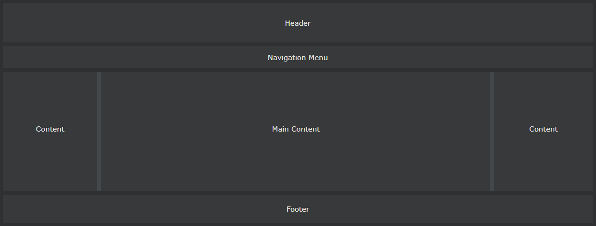
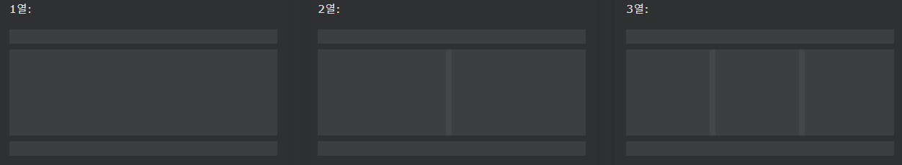

## CSS Website Layout

---

### 웹사이트 레이아웃

웹 사이트는 종종 머리글, 메뉴, 콘텐츠 및 바닥글로 나뉩니다.

선택할 수있는 다양한 레이아웃 디자인이 있습니다. 위의 구조는 가장 일반적인 구조 중 하나입니다.

---

### 헤더

헤더는 일반적으로 웹사이트 상단(또는 상단 탐색 메뉴 바로 아래)에 있습니다. 로고나 웹사이트 이름이 포함되는 경우가 많습니다.

    예시
    .header {
    background-color: #F1F1F1;
    text-align: center;
    padding: 20px;
    }

---

### 네비게이션 바

네비에는 방문자가 웹사이트를 탐색하는 데 도움이 되는 링크 목록이 포함되어 있습니다.

    예시
    /_ The navbar container _/
    .topnav {
    overflow: hidden;
    background-color: #333;
    }

    /_ Navbar links _/
    .topnav a {
    float: left;
    display: block;
    color: #f2f2f2;
    text-align: center;
    padding: 14px 16px;
    text-decoration: none;
    }

    /_ Links - change color on hover _/
    .topnav a:hover {
    background-color: #ddd;
    color: black;
    }

---

### 콘텐츠

이 섹션의 레이아웃은 종종 대상 사용자에 따라 다릅니다. 가장 일반적인 레이아웃은 다음 중 하나(또는 결합)입니다.

- 1열 (모바일 브라우저에 자주 사용됨)
- 2열 (종종 태블릿 및 랩톱에 사용됨)
- 3열 레이아웃 (데스크탑에만 사용)

우리는 3열 레이아웃을 만들고 더 작은 화면에서 1열 레이아웃으로 변경할 것입니다.

    예시

    /_ Create three equal columns that float next to each other _/
    .column {
    float: left;
    width: 33.33%;
    }

    /_ Clear floats after the columns _/
    .row:after {
    content: "";
    display: table;
    clear: both;
    }

    /_ Responsive layout - makes the three columns stack on top of each other instead of next to each other on smaller screens (600px wide or less) _/
    @media screen and (max-width: 600px) {
    .column {
    width: 100%;
    }
    }

팁: 2열 레이아웃을 생성하려면 너비를 50%로 변경하십시오. 4열 레이아웃을 만들려면 25% 등을 사용합니다.

팁: @media 규칙이 어떻게 작동하는지 궁금하십니까? [CSS 미디어 쿼리 장](https://www.w3schools.com/css/css3_mediaqueries.asp)에서 이에 대한 자세한 내용을 읽어보십시오 .

팁: 열 레이아웃을 만드는 보다 현대적인 방법은 CSS Flexbox를 사용하는 것입니다. 그러나 Internet Explorer 10 및 이전 버전에서는 지원되지 않습니다. IE6-10 지원이 필요한 경우 부동 소수점을 사용하십시오(위 그림 참조).

---

### Unequal Columns

주요 콘텐츠는 사이트에서 가장 크고 가장 중요한 부분입니다.

열 너비 가 같지 않은 경우가 일반적 이므로 대부분의 공간이 기본 콘텐츠용으로 예약됩니다. 사이드 콘텐츠(있는 경우)는 종종 대체 탐색으로 사용되거나 기본 콘텐츠와 관련된 정보를 지정하는 데 사용됩니다. 너비를 원하는 대로 변경하고 합계가 100%가 되어야 한다는 점만 기억하십시오.

    예시
    .column {
    float: left;
    }

    /* Left and right column */
    .column.side {
    width: 25%;
    }

    /* Middle column */
    .column.middle {
    width: 50%;
    }

    /* Responsive layout - makes the three columns stack on top of each other instead of next to each other */
    @media screen and (max-width: 600px) {
    .column.side, .column.middle {
        width: 100%;
    }
    }

---

### footer

footer는 페이지 하단에 배치됩니다. 여기에는 종종 저작권 및 연락처 정보와 같은 정보가 포함됩니다.

    예시
    .footer {
    background-color: #F1F1F1;
    text-align: center;
    padding: 10px;
    }
